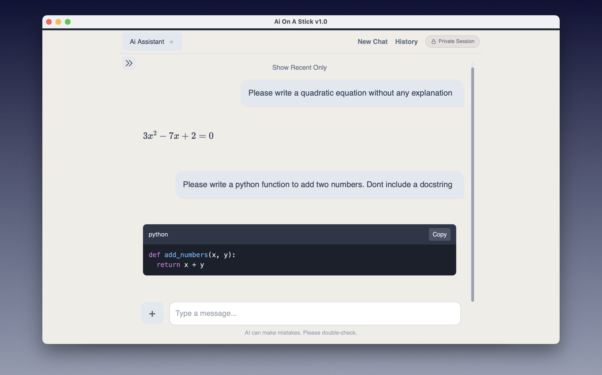
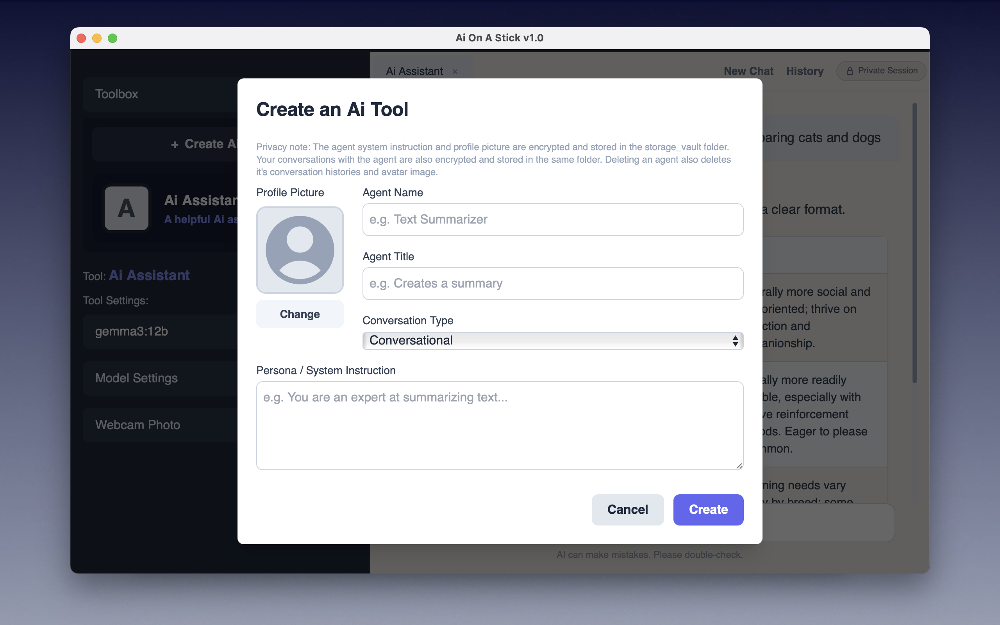

# Ai-On-A-Stick
An offline Ai Console for macOS. Powered by Gemma3:12b.<br>
This is a Thumb-Drive App (TDA).

- Works completely offline.
- No installation needed. Double-click to run.
- Fully self contained. All dependencies are bundled (9.2 GB) - including Ollama and the Gemma3 12b Q4_K_M model. 
- Locked to localhost. All user submitted data is encrypted.
- Supports LaTeX and code rendering.
- Create specialized assistants - translation, summarization, tutoring etc.
- Easy to share using a USB Drive or via AirDrop. All dependencies travel with the copy.

<br>






<br>

## What problem does this solve?

Most AI tools require you to send your data to the cloud. For anyone working with sensitive information — medical records, legal documents, financial data, or confidential research — this is a dealbreaker. You have two choices: Don't use AI assistance or accept the risk that your data may be leaked. Also, self-hosted AI solutions require a local setup that can be intimidating for non-technical users.

Ai-On-A-Stick solves both problems.

It's a fully offline, zero-install AI console that runs entirely on your local machine. Your data never leaves your device. Just double-click to launch. All dependencies, including Ollama and the Gemma3 12b model, are bundled into a single portable folder that can be carried on a USB drive or shared via AirDrop. User data is encrypted at rest, and the app is locked to localhost so no external connections are possible. The result is a capable, private AI assistant that anyone can use on sensitive data, with no setup friction and no privacy tradeoffs.

Also, built-in LaTeX and code rendering makes Ai-On-A-Stick a capable educational tool. Students can work through mathematics, physics, and engineering problems and see equations rendered properly — the way they would appear in a textbook — rather than as raw markup. For programming students, code responses are syntax-highlighted and properly formatted. This makes the code easy to read and learn from. And because the app works completely offline with no account or subscription required, it's accessible to all students, regardless of whether or not they have internet access.


<br>

## Download the Project Folder

The code is stored in a Hugging Face dataset. Hugging Face automatically generates SHA256 hashes for every file in a dataset repository. This gives this project better verifiability than most conventional software downloads.<br>
Please click this link to auto download:<br>
https://huggingface.co/datasets/vbookshelf/Ai-On-A-Stick-TDA/resolve/main/AI-On-A-Stick-v1.0-TDA.zip?download=true

<br>

## Quick Guide

<strong>System Requirements</strong>

<strong>Operating System</strong>: macOS<br>
<strong>Computer</strong>: Apple Silicon Mac (M1, M2, M3, etc.)<br>
<strong>Memory</strong>: 16 GB RAM<br>
<strong>Storage</strong>: 9.2 GB

```
[ macOS ]

1. Unzip the AI-On-A-Stick-v1.0-TDA.zip file and place it on your desktop.
2. Open the terminal (Command+Space, type "Terminal")
3. Paste this command into the terminal and press Enter:

cd Desktop/AI-On-A-Stick-v1.0-TDA

4. Paste this command into the terminal and press Enter:

cat start-mac-app.command > temp && mv temp start-mac-app.command && chmod +x start-mac-app.command

5. Open the AI-On-A-Stick-v1.0-TDA folder.
6. Double-click: start-mac-app.command
7. If a macOS security popup appears, click: "Allow"

```

<br>

## References

- HuggingFace Dataset<br>
  https://huggingface.co/datasets/vbookshelf/Ai-On-A-Stick-TDA

- Thumb-Drive App Concept<br>
https://github.com/vbookshelf/Thumb-Drive-App-Concept

- Single-File Architecture: One file to rule the all<br>
https://github.com/vbookshelf/Single-File-Flask-Web-App

<br>

## Revision History

Version 1.0<br>
11-March-2026<br>
Prototype. Released for testing.

<br>
